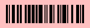

# Barcode generator in Solidity

Generate barcodes SVGs on-chain.
Limitations: Code-128 Character set C only.

## Demo

`await bar.draw(31488755, "0", "0", "ffc0c0", 58);`

## Deployment

Ethereum Mainnet, contract's address: `0xto-do`

[Verified source](https://etherscan.io/address/0xto-do#code)